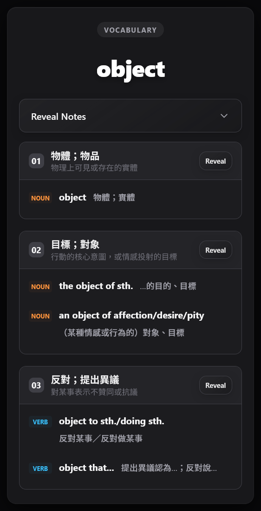
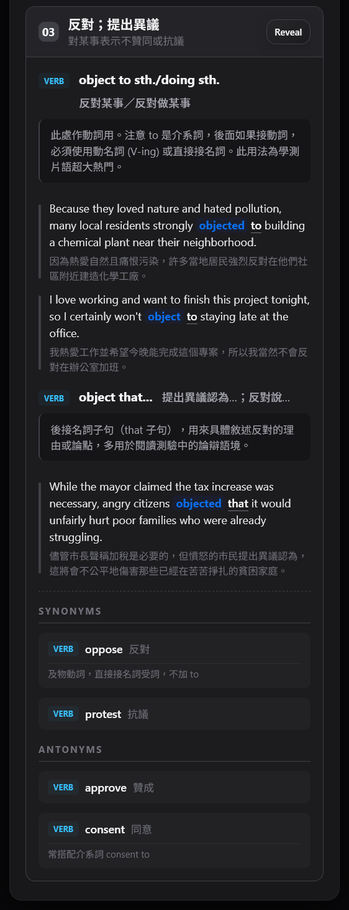
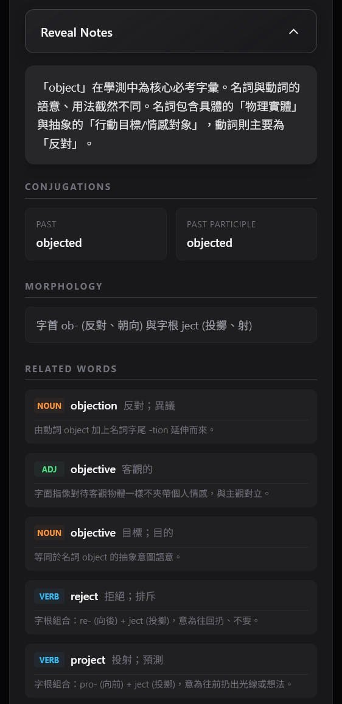

# GSAT English Vocabulary

This repository contains a collection of vocabulary for GSAT listed in `data/` directory, along with generated TSV for Anki. Templates and stylings are also provided.

The project uses a sense-based approach to ensure all common meanings of a word are covered, with a strong focus on collocations to help students learn how words are actually used in context.

The cards are currently under development. I would appreciate support on additional card generations or corrections.

## Card Content

### Front Side
- Headword

### Back Side
- Headword
- Meta-section: (Reveal)
  - General explanation
  - Conjugations & Morphology
  - Related words
- Senses:
    - Sense pattern and translation (Always visible)
    - A "Reveal" button that shows:
        - Collocation patterns and their translations
        - Usage explanations
        - Example sentences with translations
        - Synonyms and Antonyms

## Card Status

Currently I have completed the following cards (on this branch):

- Level 1 - 0/1013
- Level 2 - 0/1003
- Level 3 - 1002/1002
- Level 4 - 1002/1002
- Level 5 - 200/1002
- Level 6 - 0/1008

The remaining levels are yet to be generated. You can help by generating cards for any level (probably level 5 would be the best). Simply use the `--level X` flag on `python process.py` (e.g. `python process.py --level 5`). However, a Gemini API key is required (change the `.env.example` to `.env` and fill in the API key), which can be obtained for free on [Google AI Studio](https://aistudio.google.com/api-keys).

All sentences are marked with `<pattern> ... </pattern>` and `<target> ... </target>` tags. The target words are marked with `<target> ... </target>` tags, while the collocation words are marked with `<pattern> ... </pattern>` tags.

There's currently a high amount of cards with errors in `<pattern> ... </pattern>` markings. I'm working on cleaning them up.

## Project Structure

- `data/vocabulary/`: Source word lists for each level.
- `data/raw/`: Raw Gemini API responses in TSV format (level-specific), it includes `<pattern>` and `<target>` markers.
- `data/Anki/`: Formatted TSV files ready for Anki import. (generated via `to_anki.py`)
- `templates/`: HTML and CSS for the cards.

## How to Contribute

The remaining levels are yet to be generated. You can help by generating cards for any unfinished level:

1. **Setup:** Clone the repo and install dependencies.
2. **API Key:** Change `.env.example` to `.env` and fill in your Gemini API key from [Google AI Studio](https://aistudio.google.com/api-keys).
3. **Generate:** Run `python process.py --level X` to generate the raw data.
4. **Verify & Fix:** Run `python verify.py --level X` to find errors and `python edit.py --level X` to fix them (this is powered by AI also).
5. **Export:** Run `python to_anki.py --level X` to generate the Anki import file in `data/Anki/`.
6. **Preview:** Run `python preview.py` to verify card styling and reveal functionality locally before import.
7. **Submit:** Create a Pull Request on GitHub with the new files in `data/raw/` and `data/Anki/`.

## Data Source

The vocabulary data is taken from [CEEC](https://www.ceec.edu.tw/xmdoc?xsmsid=0K213553204833715309).

## Acknowledgements

The deck is entirely AI-generated and provided as-is. Please be mindful of potential AI hallucinations or errors. Use this resource to supplement your studies, but verify critical information with a primary source.
